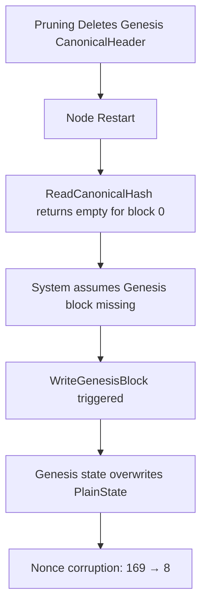

# Nonce Corruption Issue Analysis and Solution

## Executive Summary

This document describes a critical issue where the X Layer Erigon database pruning tool caused `PlainState` nonce corruption, leading to "nonce too low" errors during transaction execution. The root cause was identified as Genesis block rewriting triggered by missing `CanonicalHeader` entries after pruning. A comprehensive solution was implemented with Genesis block protection mechanisms.

## Issue Description

### Symptoms
- **Error**: `nonce too low: address 0x8f8E2d6cF621f30e9a11309D6A56A876281Fd534, tx: 8 state: 169`
- **Context**: Occurred after database pruning when the sequencer node tried to execute transactions
- **Impact**: Sequencer reported nonce=8, but RPC node's EVM saw nonce=169, causing transaction validation failures

### Environment
- **Component**: X Layer Erigon blockchain node
- **Operation**: Database pruning using `prune-chaindata` tool
- **Mode**: Both Moderate and Aggressive pruning levels affected
- **Tables Involved**: `PlainState`, `CanonicalHeader`, `Header`, `HeaderNumber`, `BlockBody`

## Root Cause Analysis

### Investigation Process

1. **Initial Hypothesis**: Direct `PlainState` corruption during pruning
   - **Result**: Debugging showed `PlainState` was not directly modified by pruning operations

2. **Secondary Investigation**: Block resolution logic issues
   - **Discovery**: The issue occurred during node startup, not during pruning

3. **Deep Debugging**: Added comprehensive logging to track nonce changes
   - **Key Finding**: Nonce corruption happened during Genesis block rewriting at node startup

### Root Cause Identified

The pruning process inadvertently deleted Genesis block's `CanonicalHeader` entry (block 0), causing the following chain reaction:



### Technical Details

1. **Pruning Stage**: 
   - Copy-truncate-restore logic cleared `CanonicalHeader` table completely
   - Genesis block (block 0) entry was not preserved
   - Other tables (`Header`, `HeaderNumber`, `BlockBody`) correctly preserved recent blocks

2. **Node Startup Stage**:
   ```go
   // In genesis_write.go
   storedHash, storedErr := rawdb.ReadCanonicalHash(tx, 0)
   if (storedHash == libcommon.Hash{}) {
       // System thinks Genesis is missing!
       logger.Info("Writing custom genesis block")
       block, _, _, err1 := write(tx, genesis, tmpDir, logger)
   }
   ```

3. **State Corruption**:
   ```go
   // Genesis writing overwrites existing PlainState
   stateWriter = state.NewPlainStateWriter(tx, tx, 0)
   if err := statedb.CommitBlock(&chain.Rules{}, stateWriter); err != nil {
       // This overwrites current account states with genesis values
   }
   ```

### Debug Evidence

**Before Pruning** (Correct state):
```
📊 PlainState DIRECT: address=0x8f8E2d6cF621f30e9a11309D6A56A876281Fd534, nonce=169
```

**After Pruning** (Tool working correctly):
```
📊 PlainState DIRECT: address=0x8f8E2d6cF621f30e9a11309D6A56A876281Fd534, nonce=169
```

**After Node Restart** (Corruption detected):
```
🔥 [PlainStateWriter] UpdateAccountData: address=0x8f8E2d6cF621f30e9a11309D6A56A876281Fd534, old_nonce=0, new_nonce=8
📊 PlainState DIRECT: address=0x8f8E2d6cF621f30e9a11309D6A56A876281Fd534, nonce=8
```

## Solution Implementation

### Genesis Block Protection Strategy

The solution implements automatic Genesis block protection across all pruning modes:

#### 1. Configuration Enhancement
```go
type MainConfig struct {
    // ... existing fields
    GenesisBlockHeight uint64 // Genesis block height to protect (default: 0)
}
```

#### 2. Automatic Genesis Detection and Protection
```go
func copyBlockData(tx kv.RwTx, blockNos []uint64, genesisHeight uint64) ([]BlockData, error) {
    // Genesis protection: Always preserve genesis block to prevent genesis rewrite
    hasGenesis := false
    for _, blockNo := range blockNos {
        if blockNo == genesisHeight {
            hasGenesis = true
            break
        }
    }
    if !hasGenesis {
        fmt.Printf("🛡️ Protecting Genesis block (%d) to prevent PlainState corruption\n", genesisHeight)
        blockNos = append([]uint64{genesisHeight}, blockNos...)
    }
    // ... rest of function
}
```

#### 3. Special CanonicalHeader Handling
```go
// During copy phase
if blockNo == genesisHeight {
    fmt.Printf("🛡️ Preserving Genesis CanonicalHeader (height=%d)\n", genesisHeight)
    cursor, err := tx.CursorDupSort("CanonicalHeader")
    if err == nil {
        defer cursor.Close()
        key, value, err := cursor.SeekExact(blockKey)
        if err == nil && key != nil && value != nil {
            blockData.Data["CanonicalHeader"] = append([]byte{}, value...)
        }
    }
}

// During restore phase
if table == "CanonicalHeader" {
    fmt.Printf("🛡️ Restoring Genesis CanonicalHeader (height=%d)\n", blockData.BlockNo)
    err := tx.Put(table, blockKey, data)
    // ... error handling
}
```

### Command Line Interface

```bash
# Default Genesis height (0)
./prune-chaindata /path/to/chaindata moderate --keep-recent-batches 10

# Custom Genesis height
./prune-chaindata /path/to/chaindata aggressive --keep-recent-batches 5 --genesis-height 0

# Alternative syntax
./prune-chaindata /path/to/chaindata moderate --genesis-height=0 --keep-recent-batches 10
```

### Implementation Coverage

The Genesis protection is implemented across all pruning components:

1. **Moderate Mode**: `executeBatchOperationsWithCommit()` → `partialPruneBatchTables()` → `copyBlockData()`
2. **Aggressive Mode**: 
   - Header ecosystem: `executeHeaderEcosystemCleanupWithCommit()` → `copyHeaderEcosystemBlockData()`
   - DupCursor tables: Inherits protection from batch operations
3. **All Copy-Truncate-Restore Operations**: Automatic Genesis inclusion and special handling

## Verification and Testing

### Pre-Fix Behavior
```
🔍 [NODE NONCE DEBUG] AFTER CHAINDATA OPENED
📊 PlainState DIRECT: nonce=169 ✅

🔥 [PlainStateWriter] UpdateAccountData: old_nonce=0, new_nonce=8 ❌
[INFO] Writing custom genesis block
```

### Post-Fix Behavior
```
🔍 [NODE NONCE DEBUG] AFTER CHAINDATA OPENED  
📊 PlainState DIRECT: nonce=169 ✅

🛡️ Protecting Genesis block (0) to prevent PlainState corruption
🛡️ Preserving Genesis CanonicalHeader (height=0)
🛡️ Restoring Genesis CanonicalHeader (height=0)

# No Genesis rewriting occurs
📊 PlainState DIRECT: nonce=169 ✅ (preserved)
```

## Technical Benefits

1. **Zero Data Loss**: Genesis block data is always preserved regardless of user-specified parameters
2. **Backward Compatibility**: Default behavior protects standard Genesis at height 0
3. **Flexibility**: Supports custom Genesis heights for non-standard deployments
4. **Automatic Protection**: No manual intervention required - protection is applied automatically
5. **Comprehensive Coverage**: Works across all pruning modes (Moderate, Aggressive)

## Performance Impact

- **Minimal Overhead**: Only one additional block (Genesis) is preserved
- **Efficient Implementation**: Uses existing copy-truncate-restore infrastructure
- **No Runtime Impact**: Protection occurs only during pruning, not during normal node operation

## Prevention Measures

The solution includes multiple layers of protection:

1. **Proactive Detection**: Automatic scanning for Genesis block in preservation list
2. **Explicit Inclusion**: Automatic addition if not present
3. **Special Handling**: Dedicated logic for CanonicalHeader preservation and restoration
4. **Verification**: Debug logging confirms Genesis protection is active

## Conclusion

The nonce corruption issue was caused by an indirect interaction between database pruning and Genesis block detection logic. The pruning process inadvertently removed Genesis block metadata, triggering Genesis rewriting at node startup, which corrupted the current state.

The implemented solution provides robust Genesis block protection that:
- Prevents the root cause (missing Genesis CanonicalHeader)
- Maintains system integrity across all pruning scenarios  
- Requires no changes to existing node logic
- Supports flexible Genesis configurations

This fix ensures that database pruning operations preserve critical system state while maintaining the efficiency and effectiveness of the pruning process.
